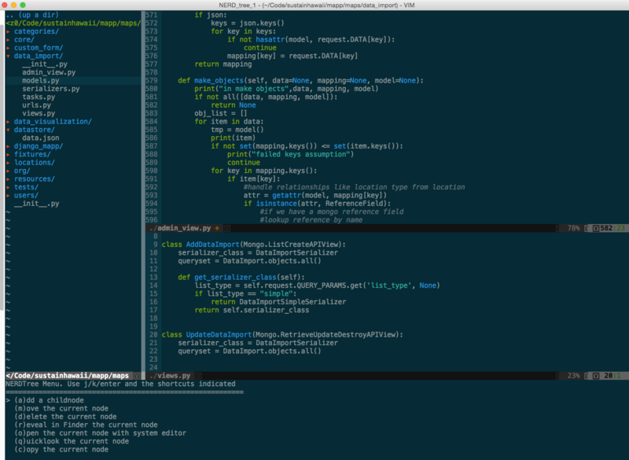
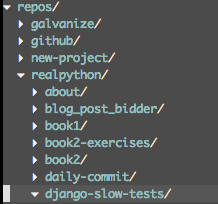

> 本文由编程派-EarlGrey翻译，原文出自[realpython](https://realpython.com/blog/python/vim-and-python-a-match-made-in-heaven/)，是Vim的爱好者专门针对[利用Sublime Text 3设置Python IDE](https://realpython.com/blog/python/setting-up-sublime-text-3-for-full-stack-python-development/)一文所写。译者本人也是依照Sublime Text那篇文章配置的开发环境，但一直对Vim作为神器的美名非常仰慕，又看到了一篇这么全面的配置文章，觉得有必要翻译过来与大家分享，想必可以省却很多自己研究如何配置的时间。

我注意到，有人在realpython.com宣扬[Sublime Text 3](https://realpython.com/blog/python/setting-up-sublime-text-3-for-full-stack-python-development/)。作为公司的资深开发人员（呃，也就是老古董），我觉得有义务介绍一个**真正**的Python开发环境给大家——我要推荐的当然就是Vim了。不错，Vim编辑器无处不在，速度快，从来不会崩溃。并且，它能做任何事情！

不过，不利之处也有，就是Vim配置起来很让人头疼。但是，别担心，**本文将告诉你如何配置一个强大的Vim环境，专门用于天天捣鼓Python开发。**

下面是最终效果预览。



> 如果想充分地利用好本文，你应该对如何使用Vim和它的命令模式至少有一个基本的了解。如果你是初学者，你可以通过[vim-adventure](http://vim-adventures.com/)或者[openvim](http://www.openvim.com/)网站学习。在继续阅读本文之前，请花点时间浏览那两个网站的内容。

安装
--

因为许多Unix衍生系统已经预装了Vim，我们首先要确认编辑器是否成功安装：

```
vim --version

```

如果已经安装了，你应该看到类似下面的文字：

```
VIM - Vi IMproved 7.3 (2010 Aug 15, compiled Nov  5 2014 21:00:28)
Compiled by root@apple.com
Normal version without GUI.  Features included (+) or not (-):
-arabic +autocmd -balloon_eval -browse +builtin_terms +byte_offset +cindent
-clientserver -clipboard +cmdline_compl +cmdline_hist +cmdline_info +comments
-conceal +cryptv +cscope +cursorbind +cursorshape +dialog_con +diff +digraphs
-dnd -ebcdic -emacs_tags +eval +ex_extra +extra_search -farsi +file_in_path
+find_in_path +float +folding -footer +fork() -gettext -hangul_input +iconv
+insert_expand +jumplist -keymap -langmap +libcall +linebreak +lispindent
+listcmds +localmap -lua +menu +mksession +modify_fname +mouse -mouseshape
-mouse_dec -mouse_gpm -mouse_jsbterm -mouse_netterm -mouse_sysmouse
+mouse_xterm +multi_byte +multi_lang -mzscheme +netbeans_intg -osfiletype
+path_extra -perl +persistent_undo +postscript +printer -profile +python/dyn
-python3 +quickfix +reltime -rightleft +ruby/dyn +scrollbind +signs
+smartindent -sniff +startuptime +statusline -sun_workshop +syntax +tag_binary
+tag_old_static -tag_any_white -tcl +terminfo +termresponse +textobjects +title
 -toolbar +user_commands +vertsplit +virtualedit +visual +visualextra +viminfo
+vreplace +wildignore +wildmenu +windows +writebackup -X11 -xfontset -xim -xsmp
 -xterm_clipboard -xterm_save
   system vimrc file: "$VIM/vimrc"
     user vimrc file: "$HOME/.vimrc"
      user exrc file: "$HOME/.exrc"
  fall-back for $VIM: "/usr/share/vim"
Compilation: gcc -c -I. -D_FORTIFY_SOURCE=0 -Iproto -DHAVE_CONFIG_H -arch i386 -arch x86_64 -g -Os -pipe
Linking: gcc -arch i386 -arch x86_64 -o vim -lncurses

```

在这一步，你要确保已经满足以下两点要求：

1. Vim编辑版本应该大于7.3。
2. 支持Python语言。在所选编辑器的功能中，确保你看到了`+python`。

如果满足上述要求，接下来可以安装[Vim扩展](https://www.codingpy.com/article/vim-setup-for-fullstack-python-development#vim)了。如果不满足，则需要[安装/升级](http://www.vim.org/download.php)。

### OS X

如果没有[Homebrew](http://brew.sh/)，建议马上安装，并运行：

```
brew update
brew install vim

```

### Unix衍生系统

Debian或Ubuntu系统，可以使用下面的代码：

```
sudo apt-get remove vim-tiny
apt-get update
apt-get install vim

```

如果是其他版本的Linux系统，请查阅相应版本包管理器的文档。不清楚的话，可以先阅读这篇文章：[安装Vim](http://oss.sgi.com/LDP/HOWTO/Vim-HOWTO/introduction.html)

### Windows

Windows系统下安装Vim有很多种方法。请查阅[官方文档](http://www.vim.org/download.php#pc)。

验证安装
----

确保你已经安装了7.3版本以上、支持Python的Vim编辑器。你可以再次运行`vim --version`进行确认。如果你想知道Vim中使用的Python版本，你可以在编辑器中运行`:python import sys; print(sys.version)`。

```
2.7.6 (default, Sep  9 2014, 15:04:36)
[GCC 4.2.1 Compatible Apple LLVM 6.0 (clang-600.0.39)]

```

这行命令会输出你的编辑器当前的Python版本。如果报错，那么你的编辑器就不支持Python语言，需要重装或重新编译。

Vim编辑器安装完成后，我们来看看如何将其设置为Python开发的强大环境。

Vim扩展
-----

Vim本身能够满足开发人员的很多需求，但是它的可扩展性也极强，并且已经有一些杀手级的扩展，可以让Vim拥有“现代”集成开发环境的特性。所以，你所需要的第一件东西就是一个好用的扩展管理器。

> Vim的扩展通常也被成为bundle或[插件](http://vimdoc.sourceforge.net/htmldoc/usr_05.html#plugin)。

### Vundle

Vim有多个扩展管理器，但是我们强烈推荐[Vundle](https://github.com/gmarik/Vundle.vim)。你可以把它想象成Vim的pip。有了Vundle，安装和更新包这种事情不费吹灰之力。

我们现在来安装Vundle：

```
git clone https://github.com/gmarik/Vundle.vim.git ~/.vim/bundle/Vundle.vim

```

该命令将下载Vundle插件管理器，并将它放置在你的Vim编辑器bundles文件夹中。现在，你可以通过.vimrc[配置文件](https://github.com/amix/vimrc)来管理所有扩展了。

将配置文件添加到你的用户的home文件夹中：

```
touch ~/.vimrc

```

接下来，把下来的Vundle配置添加到配置文件的顶部：

```

set nocompatible              " required
filetype off                  " required

" set the runtime path to include Vundle and initialize
set rtp+=~/.vim/bundle/Vundle.vim
call vundle#begin()

" alternatively, pass a path where Vundle should install plugins
"call vundle\#begin('~/some/path/here')

" let Vundle manage Vundle, required
Plugin 'gmarik/Vundle.vim'

" Add all your plugins here (note older versions of Vundle used Bundle instead of Plugin)

```

```
" All of your Plugins must be added before the following line
call vundle#end()            " required
filetype plugin indent on    " required

```

这样，你就完成了使用Vundle前的设置。之后，你就可以在配置文件中添加希望安装的插件，然后打开Vim编辑器，运行下面的命令：

```
:PluginInstall

```

这个命令告诉Vundle施展它的魔法——自动下载所有的插件，并为你进行安装和更新。


> 对于Windows用户，请查阅[Windows安装指南](https://github.com/gmarik/Vundle.vim/wiki/Vundle-for-Windows)。

开始打造IDE吧
--------

本文不可能列举Vim的全部功能，只能快速介绍一些Vim自带的强大功能，它们对于Python开发来说是非常有用的。

### 扔掉鼠标

或许，Vim编辑器*最重要*的功能就是它不要求使用鼠标（除了GUI版本外）。一开始，你可能会觉得这是个非常糟糕的做法，但是只要你投入时间——是的，这很花时间——学习[快捷组合键](http://stackoverflow.com/a/5400978/1799408)，就可以大幅提升工作流的速度。

### 分割布局（Split Layouts）


使用`:sv <filename>`命令打开一个文件，你可以纵向分割布局（新文件会在当前文件下方界面打开），使用相反的命令`:vs <filename>`， 你可以得到横向分割布局（新文件会在当前文件右侧界面打开）。

你还可以嵌套分割布局，所以你可以在分割布局内容再进行分割，纵向或横向都可以，直到你满意为止。众所周知，我们开发时经常需要同时查看多个文件。

**专业贴士**：记得在输入完`:sv`后，利用tab补全功能，快速查找文件。

**专业贴士**：你还可以指定屏幕上可以进行分割布局的区域，只要在`.vimrc`文件中添加下面的代码即可：

```
set splitbelow
set splitright

```

**专业贴士**：想要不使用鼠标就切换分割布局吗？只要将下面的代码添加到`.vimrc`文件中，你就可以通过快捷组合键进行切换。

```
"split navigations
nnoremap \<C-J\> \<C-W\>\<C-J\>
nnoremap \<C-K\> \<C-W\>\<C-K\>
nnoremap \<C-L\> \<C-W\>\<C-L\>
nnoremap \<C-H\> \<C-W\>\<C-H\>

```

组合快捷键：

* `Ctrl-j` 切换到下方的分割窗口
* `Ctrl-k` 切换到上方的分割窗口
* `Ctrl-l` 切换到右侧的分割窗口
* `Ctrl-h` 切换到左侧的分割窗口

换句话说, 按`Ctrl`+Vim的标准移动键，就可以切换到指定窗口。

> 等等，`nnoremap`是什么意思？——简单来说，`nnoremap`将一个组合快捷键映射为另一个快捷键。一开始的`n`，指的是在Vim的正常模式（Normal Mode）下，而不是可视模式下重新映射。基本上，`nnoremap <C-J> <C-W><C-j>`就是说，当我在正常模式按下\<C-J\>时，进行\<C-W\>\<C-j\>操作。更多信息请看[这里](http://stackoverflow.com/questions/3776117/what-is-the-difference-between-the-remap-noremap-nnoremap-and-vnoremap-mapping)。

### 缓冲区（Buffers）

虽然Vim支持tab操作，仍有很多人更喜欢缓冲区和分割布局。你可以把缓冲区想象成最近打开的一个文件。Vim提供了方便访问近期缓冲区的方式，只需要输入`:b <buffer name or number>`，就可以切换到一个已经开启的缓冲区（此处也可使用自动补全功能）。你还可以通过`ls`命令查看所有的缓冲区。

**专业贴士**: 在`:ls`命令输出的最后，Vim会提示“敲击Enter继续查看”，这时你可以直接输入`:b <buffer name>`，立即选择缓冲区。这样可以省掉一个按键操作，也不必去记忆缓冲区的名字。

### 代码折叠（Code Folding）

大多数“现代”集成开发环境（IDE）都提供对方法（methods）或类（classes）进行折叠的手段，只显示类或方法的定义部分，而不是全部的代码。

你可以在`.vimrc`中添加下面的代码开启该功能：

```
" Enable folding
set foldmethod=indent
set foldlevel=99

```

这样就可以实现，但是你必须手动输入`za`来折叠（和取消折叠）。使用空格键会是更好的选择。所以在你的配置文件中加上这一行命令吧：

```
" Enable folding with the spacebar
nnoremap \<space\> za

```

现在你可以轻松地隐藏掉那些当前工作时不需要关注的代码了。

第一个命令，`set foldmethod=ident`会根据每行的缩进开启折叠。但是这样做会出现超过你所希望的折叠数目。但是别怕，有几个扩展就是专门解决这个问题的。在这里，我们推荐SimplyFold。在`.vimrc`中加入下面这行代码，通过Vundle进行安装：

```
Plugin 'tmhedberg/SimpylFold'

```

> 不要忘记执行安装命令：`:PluginInstall`

**专业贴士**: 希望看到折叠代码的文档字符串？

```
let g:SimpylFold\_docstring\_preview=1

```

### Python代码缩进

当然，想要代码折叠功能根据缩进情况正常工作，那么你就会希望自己的缩进是正确的。这里，Vim的自带功能无法满足，因为它实现不了定义函数之后的自动缩进。我们希望Vim中的缩进能做到以下两点：

* 首先，缩进要符合PEP8标准。
* 其次，更好地处理自动缩进。

**PEP8**

要支持PEP8风格的缩进，请在`.vimrc`文件中添加下面的代码：

```
au BufNewFile,BufRead *.py
\ set tabstop=4
\ set softtabstop=4
\ set shiftwidth=4
\ set textwidth=79
\ set expandtab
\ set autoindent
\ set fileformat=unix

```

这些设置将让Vim中的Tab键就相当于4个标准的空格符，确保每行代码长度不超过80个字符，并且会以unix格式储存文件，避免在推送到Github或分享给其他用户时出现文件转换问题。

另外，对于全栈开发，你可以设置针对每种文件类型设置`au`命令：

```
au BufNewFile,BufRead *.js, *.html, *.css
\ set tabstop=2
\ set softtabstop=2
\ set shiftwidth=2

```

**自动缩进**

自动缩进有用，但是在某些情况下（比如函数定义有多行的时候），并不总是会达到你想要的效果，尤其是在符合PEP8标准方面。我们可以利用indentpython.vim插件，来解决这个问题：

```
Plugin 'vim-scripts/indentpython.vim'

```

### 标示不必要的空白字符

我们希望避免出现多余的空白字符。可以让Vim帮我们标示出来，使其很容易发现并删除。

```
au BufRead,BufNewFile *.py,*.pyw,*.c,*.h match BadWhitespace /\s\+$/

```

这会将多余的空白字符标示出来，很可能会将它们变成红色突出。

### 支持UTF-8编码

大部分情况下，进行Python开发时你应该使用UTF-8编码，尤其是使用Python 3的时候。确保Vim设置文件中有下面的命令：

```
set encoding=utf-8

```

### 自动补全

支持Python自动补全的最好插件是YouCompleteMe。我们再次使用Vundle安装：

```
Bundle 'Valloric/YouCompleteMe'

```

YouCompleteMe插件其实底层使用了一些不同的自动补全组件（包括针对Python开发的Jedi），另外要安装一些C库才能正常工作。插件官方文档提供了很好的[安装指南](https://github.com/Valloric/YouCompleteMe#mac-os-x-super-quick-installation)，我就不在这里重复了。切记跟随文档的步骤进行安装。

安装完成后，插件自带的设置效果就很好，但是我们还可以进行一些小的调整：

```
let g:ycm\_autoclose\_preview\_window\_after\_completion=1
map \<leader\>g  :YcmCompleter GoToDefinitionElseDeclaration\<CR\>

```

上面的第一行确保了在你完成操作之后，自动补全窗口不会消失，第二行则定义了**“转到定义”**的快捷方式。

### 支持Virtualenv虚拟环境

上面**“转到定义”**功能的一个问题，就是默认情况下Vim不知道virtualenv虚拟环境的情况，所以你必须在配置文件中添加下面的代码，使得Vim和YouCompleteMe能够发现你的虚拟环境：

```
"python with virtualenv support
py << EOF
import os
import sys
if 'VIRTUAL\_ENV' in os.environ:
  project_base_dir = os.environ['VIRTUAL\_ENV']
  activate_this = os.path.join(project_base_dir, 'bin/activate\_this.py')
  execfile(activate_this, dict(__file__=activate_this))
EOF

```

这段代码会判断你目前是否在虚拟环境中编辑，然后切换到相应的虚拟环境，并设置好你的系统路径，确保YouCompleteMe能够找到相应的site packages文件夹。

### 语法检查/高亮

通过安装[syntastic](https://github.com/scrooloose/syntastic)插件，每次保存文件时Vim都会检查代码的语法：

```
Plugin 'scrooloose/syntastic'

```

还可以通过这个小巧的插件，添加PEP8代码风格检查：

```
Plugin 'nvie/vim-flake8'

```

最后，让你的代码变得更漂亮：

```
let python_highlight_all=1
syntax on

```

### 配色方案

配色方案可以和你正在使用的基础配色共同使用。GUI模式可以尝试[solarized方案](https://github.com/altercation/vim-colors-solarized), 终端模式可以尝试[Zenburn方案](https://github.com/jnurmine/Zenburn)：

```
Plugin 'jnurmine/Zenburn'
Plugin 'altercation/vim-colors-solarized'

```

接下来，只需要添加一点逻辑判断，确定什么模式下使用何种方案就可以了：

```

if has('gui\_running')
  set background=dark
  colorscheme solarized
else
  colorscheme Zenburn
endif

```

Solarized方案同时提供了暗色调和轻色调两种主题。要支持切换主题功能（按F5）也非常简单，只需添加：

```
call togglebg\#map("\<F5\>")

```

### 文件浏览

如果你想要一个不错的文件树形结构，那么NERDTree是不二之选。

```
Plugin 'scrooloose/nerdtree'

```

如果你想用tab键，可以利用vim-nerdtree-tabs插件实现：

```

Plugin 'jistr/vim-nerdtree-tabs'

```

还想隐藏.pyc文件？那么再添加下面这行代码吧：

```
let NERDTreeIgnore=['\\.pyc$', '\\~$'] "ignore files in NERDTree

```

### 超级搜索

想要在Vim中搜索任何文件？试试ctrlP插件吧：

```
Plugin 'kien/ctrlp.vim'

```

正如插件名，按Ctrl+P就可以进行搜索。如果你的检索词与想要查找的文件相匹配的话，这个插件就会帮你找到它。哦，对了——它不仅仅可以搜索文件，还能检索标签！更多信息，可以观看这个[Youtube视频](http://www.youtube.com/watch?v=9XrHk3xjYsw).

### 显示行号

开启显示行号：

```
set nu

```

### Git集成

想要在Vim中执行基本的Git命令？vim-fugitive插件则是不二之选。

```
Plugin 'tpope/vim-fugitive'

```



请看Vimcasts的[这部视频](http://vimcasts.org/episodes/fugitive-vim---a-complement-to-command-line-git/)，了解更多情况。

### Powerline状态栏

Powerline是一个状态栏插件，可以显示当前的虚拟环境、Git分支、正在编辑的文件等信息。

这个插件是用Python编写的，支持诸如zsh、bash、tmux和IPython等多种环境。

```
Plugin 'Lokaltog/powerline', {'rtp': 'powerline/bindings/vim/'}

```

请查阅插件的官方文档，了解配置选项。

### 系统剪贴板

通常Vim会忽视系统剪贴板，而使用自带的剪贴板。但是有时候你想从Vim之外的程序中剪切、复制、粘贴文本。在OS X平台上，你可以通过这行代码访问你的系统剪贴板：

```
set clipboard=unnamed

```

### Shell开启Vim编辑模式

最后，当你熟练掌握了Vim和它的键盘快捷方式之后，你会发现自己经常因为shell中缺乏相同的快捷键而懊恼。没关系，大部分的shell程序都有Vi模式。在当前shell中开启Vi模式，你只需要在`~/.inputrc`文件中添加这行代码：

```
set editing-mode vi

```

现在，你不仅可以在shell中使用Vim组合快捷键，还可以在Python解释器以及任何利用GNU Readline程序的工具（例如，大多数的数据库shell）中使用。现在，你在什么地方都可以使用Vim啦！

结语
--

Vim的设置到这里就差不多了（至少对于Python开发来说是这样的）。当然，开源世界里还有大量你可以使用的其他扩展，以及本文中所提到插件的替代品。你最喜爱的扩展是什么？你又是如何将Vim设置符合你喜好的？

这是我本人的[Vim配置文件链接](https://github.com/j1z0/vim-config/blob/master/vimrc)。你有没有自己的设置代码？请与我们分享！

谢谢！

资源
--

1. [Vim Tutor](http://linuxcommand.org/man_pages/vimtutor1.html)是Vim自带的程序，安装结束之后，只要在命令行输入`vimtutor`即可，程序将会用Vim编辑器教你如何使用Vim。
2. [Vimcasts](http://vimcasts.org/)是一系列的高阶视频教程，内容涉及许多Vim的功能。
3. [Vim官方文档](http://www.vim.org/docs.php)
4. [Open Vim](http://www.openvim.com/)
5. [笨办法学Vimscript](http://learnvimscriptthehardway.stevelosh.com/)是学习vimscript的极好材料。

全文结束